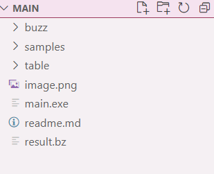
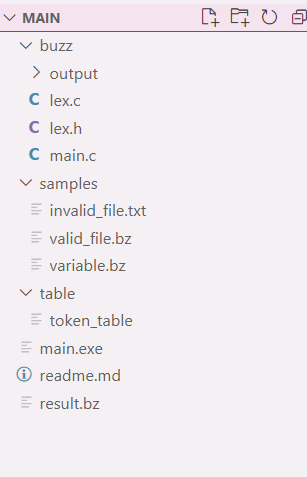

What the folder looks like? 

 (this are the files)

Create main executable file - gcc buzz/lex.c buzz/main.c -o main.exe

Compile the sample files in the sample folder - main.exe samples/variable.bz result.bz